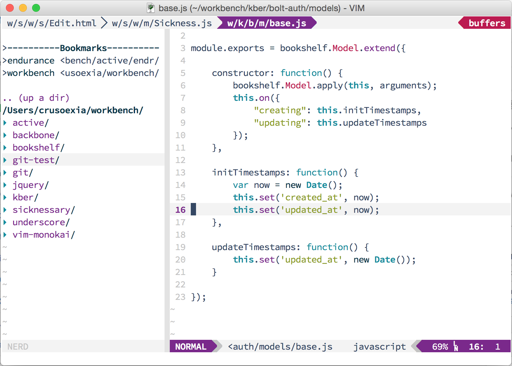
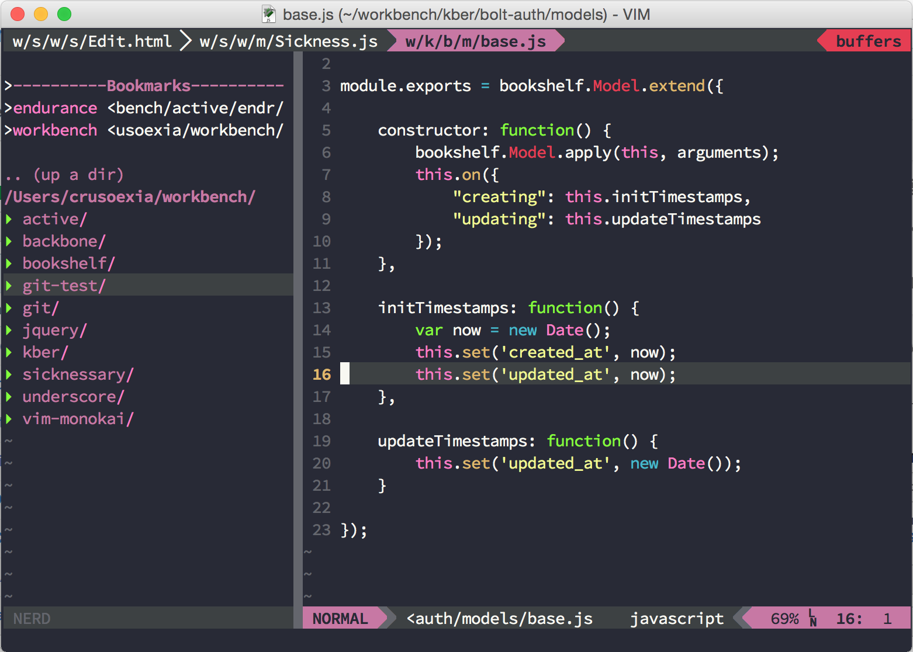
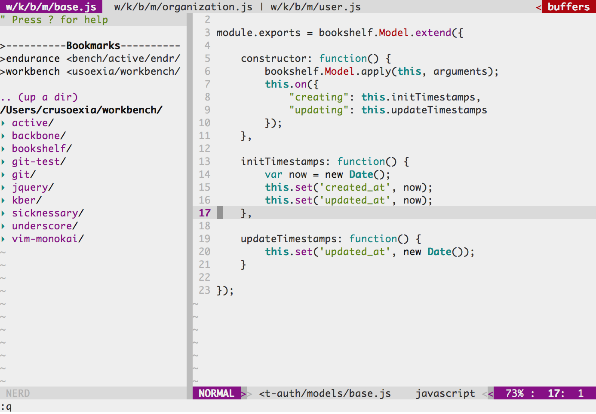
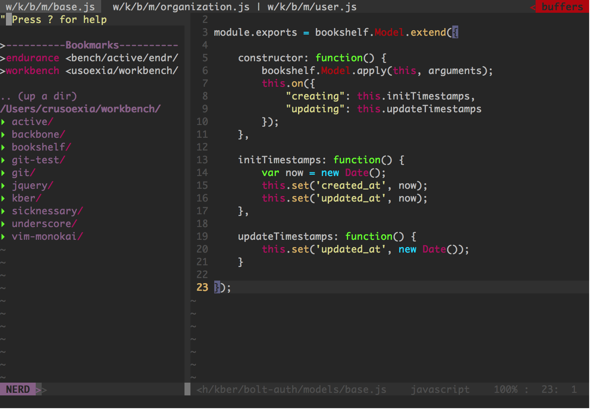

Vim dream
=========

A color scheme focus on coding. Its easy to read, comfort for eyes, provide both light and dark themes.

Install
---------

[Vundle](https://github.com/gmarik/Vundle.vim)

    Plugin 'crusoexia/vim-dream'

Usage
---------

_Dream light:_

    colorscheme dream-light

_Dream dark:_

    colorscheme dream-dark

Screenshots
--------

### GUI

### Terminal

