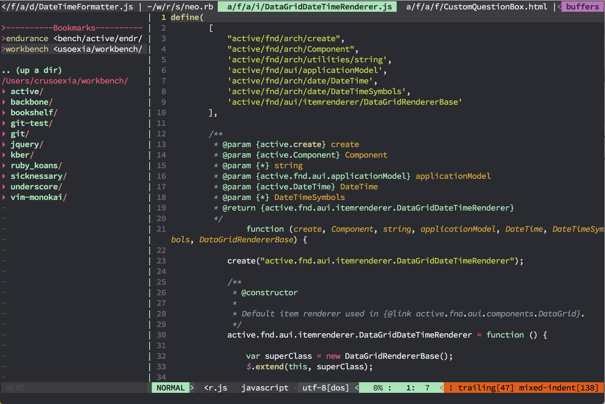

Vim dream
=========

A color scheme for vim, provide both dark and light theme.

Install
-------

[Vundle](https://github.com/gmarik/Vundle.vim)

    Plugin 'crusoexia/vim-dream'

Usage
-----

_Dream:_

    colorscheme dream

_Dream light:_

    colorscheme dream-light

Original dream-dark theme
-------------------------

For the original _dream-dark_ user, please refer to [vim-dracula](https://github.com/crusoexia/vim-dracula)

Javascript
----------

Works better with [vim-javascript](https://github.com/pangloss/vim-javascript), which provide features such as param syntax highlight.

Screenshots
-----------

_Dream:_

_Dream light:_

